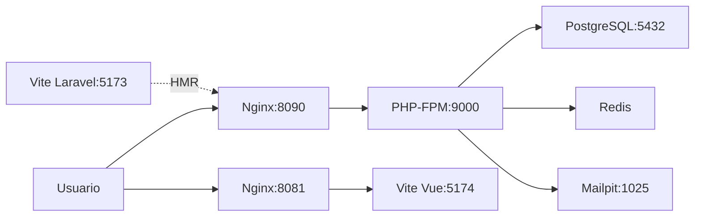

# Documentación de Arquitectura Docker - ERP Filament

## Índice
1. [Visión General](#visión-general)
2. [Arquitectura del Sistema](#arquitectura-del-sistema)
3. [docker-compose.yml - Explicación Detallada](#docker-composeyml---explicación-detallada)
4. [Dockerfile - Construcción de Imagen PHP](#dockerfile---construcción-de-imagen-php)
5. [Nginx - Configuración del Servidor Web](#nginx---configuración-del-servidor-web)
6. [Flujo de Trabajo](#flujo-de-trabajo)
7. [Comandos Útiles](#comandos-útiles)
8. [Troubleshooting](#troubleshooting)

---

## Visión General

Este proyecto implementa un **ERP con Laravel + Filament (backend) y Vue.js (frontend)** utilizando Docker para crear un entorno de desarrollo consistente y portable.

### Stack Tecnológico

- **Backend**: Laravel 12 + Filament 4 (PHP 8.3)
- **Frontend**: Vue.js 3 con Vite
- **Base de Datos**: PostgreSQL 16
- **Cache**: Redis 7
- **Servidor Web**: Nginx 1.27
- **Email Testing**: Mailpit
- **Orquestación**: Docker Compose

### Puertos Expuestos

| Servicio | Puerto Host | Puerto Contenedor | Descripción |
|----------|-------------|-------------------|-------------|
| Laravel (Nginx) | 8090 | 80 | Aplicación backend Filament |
| Vue.js (Nginx Proxy) | 8081 | 8081 | Aplicación frontend Vue |
| PostgreSQL | 5432 | 5432 | Base de datos |
| Mailpit Web UI | 8025 | 8025 | Interfaz de correos de prueba |
| Vite (Laravel) | 5173 | 5173 | Hot reload Laravel assets |
| Vite (Vue) | 5174 | 5174 | Hot reload Vue.js |

---

## Arquitectura del Sistema

```
┌─────────────────────────────────────────────────────────────┐
│                        USUARIO                               │
└───────────────────────┬─────────────────────────────────────┘
                        │
        ┌───────────────┼───────────────┐
        │               │               │
    Puerto 8090     Puerto 8081    Puerto 8025
   (Laravel/Filament) (Vue.js)     (Mailpit)
        │               │               │
┌───────▼───────────────▼───────────────▼─────────────────────┐
│                    NGINX (Contenedor)                        │
│  - Sirve Laravel desde puerto 80                            │
│  - Proxy a Vue.js en puerto 8081                            │
│  - FastCGI a PHP-FPM                                        │
└───────┬───────────────┬───────────────────────────────────┬─┘
        │               │                                   │
    ┌───▼────┐      ┌───▼────┐                        ┌────▼────┐
    │  PHP   │      │  Node  │                        │  Vue    │
    │ (FPM)  │      │ (Vite) │                        │ (Vite)  │
    │ 8.3    │      │  20    │                        │   20    │
    └───┬────┘      └────────┘                        └─────────┘
        │
    ┌───▼─────────────────────────────┐
    │  PostgreSQL      Redis  Mailpit │
    │    (DB)         (Cache) (Email) │
    └─────────────────────────────────┘
         network_app (Red Bridge)
```

### Flujo de Peticiones

**Laravel/Filament (Puerto 8090)**:
```
Usuario → http://localhost:8090
    ↓
Nginx (puerto 80) → recibe petición
    ↓
Si es .php → FastCGI a PHP-FPM (php:9000)
    ↓
PHP ejecuta Laravel → Respuesta
```

**Vue.js (Puerto 8081)**:
```
Usuario → http://localhost:8081
    ↓
Nginx (puerto 8081) → proxy_pass
    ↓
Vue Dev Server (vue:5174) → Respuesta
```

---

## docker-compose.yml - Explicación Detallada

### 1. Servicio: `php`

```yaml
php:
  image: fitopero/php_apache_without_node_for_nginx:v1
  volumes:
    - .:/var/www/html
  depends_on:
    - db
    - redis
    - mailpit
  user: "1000:1000"
  networks:
    - network_app
  deploy:
    replicas: 1
    restart_policy:
      condition: on-failure
      delay: 5s
      max_attempts: 3
      window: 30s
    resources:
      limits:
        cpus: "0.75"
        memory: 512M
      reservations:
        cpus: "0.25"
        memory: 256M
```

#### ¿Qué hace?
- **Ejecuta PHP-FPM** (FastCGI Process Manager) para procesar código PHP de Laravel
- No tiene puerto expuesto directamente porque se comunica con Nginx via red interna

#### Explicación de opciones:

- **`image`**: Usa una imagen personalizada que incluye:
  - PHP 8.3 con PHP-FPM
  - Extensiones necesarias (PostgreSQL, Redis, GD, etc.)
  - Composer instalado
  
- **`volumes`**: 
  - `.:/var/www/html` → Monta el directorio actual (código fuente) dentro del contenedor
  - Permite editar código en host y se refleja inmediatamente en el contenedor
  
- **`depends_on`**: 
  - Espera a que db, redis y mailpit estén corriendo antes de iniciar
  - No garantiza que estén "listos", solo que iniciaron
  
- **`user: "1000:1000"`**:
  - Ejecuta PHP-FPM como usuario con UID/GID 1000 (tu usuario en Linux)
  - Evita problemas de permisos en archivos generados (logs, cache, storage)
  
- **`deploy.resources`**:
  - **limits**: Máximo que puede usar (75% de 1 CPU, 512MB RAM)
  - **reservations**: Mínimo garantizado (25% CPU, 256MB RAM)
  - Protege el sistema de consumo excesivo de recursos

- **`restart_policy`**:
  - Si falla, intenta reiniciar hasta 3 veces
  - Espera 5 segundos entre intentos
  - Si falla después de 30s de ventana, no reinicia más

#### ¿Por qué no tiene `ports`?
PHP-FPM se comunica con Nginx por **socket TCP interno** (puerto 9000) dentro de la red `network_app`. No necesita estar expuesto al host.

---

### 2. Servicio: `node`

```yaml
node:
  image: node:20-alpine
  working_dir: /var/www/html
  volumes:
    - .:/var/www/html
  command: sh -c "cd Laravel_app && npm install && npm run dev"
  ports:
    - "5173:5173"
  networks:
    - network_app
```

#### ¿Qué hace?
- **Ejecuta Vite** (el bundler de assets de Laravel)
- Compila y sirve los archivos JavaScript/CSS de Filament con Hot Module Replacement (HMR)

#### Explicación de opciones:

- **`image: node:20-alpine`**: 
  - Node.js 20 en Alpine Linux (imagen ligera)
  - Alpine es ~5MB vs ~900MB de la imagen completa de Node
  
- **`working_dir`**: 
  - Directorio de trabajo inicial dentro del contenedor
  
- **`command`**:
  - `cd Laravel_app` → Entra al directorio del proyecto Laravel
  - `npm install` → Instala dependencias (solo si no existen)
  - `npm run dev` → Inicia Vite en modo desarrollo
  
- **`ports: "5173:5173"`**:
  - Expone el puerto de Vite para que Laravel pueda cargar assets con HMR
  - Cuando editas un archivo JS/CSS, el navegador se actualiza automáticamente

#### ¿Cuándo se usa?
- **En desarrollo**: Para compilar assets en tiempo real
- **En producción**: No se usa (se compilan assets con `npm run build` antes de desplegar)

---

### 3. Servicio: `vue`

```yaml
vue:
  image: node:20-alpine
  user: "1000:1000"
  working_dir: /app
  volumes:
    - ./Vue_app:/app
  command: sh -c "npm install && npm run dev -- --host 0.0.0.0 --port 5174"
  ports:
    - "5174:5174"
  networks:
    - network_app
```

#### ¿Qué hace?
- **Ejecuta Vite para la aplicación Vue.js** (frontend separado)
- Sirve la SPA (Single Page Application) en modo desarrollo

#### Explicación de opciones:

- **`volumes: ./Vue_app:/app`**:
  - Solo monta el directorio Vue_app (no todo el proyecto)
  - Aísla el frontend del backend
  
- **`command`**:
  - `-- --host 0.0.0.0` → Permite conexiones desde fuera del contenedor
  - `--port 5174` → Puerto diferente al de Laravel (5173) para evitar conflictos
  
- **`user: "1000:1000"`**:
  - Evita crear node_modules con permisos de root

#### Diferencia con el servicio `node`:
- **`node`**: Compila assets de **Laravel/Filament** (Blade, Livewire)
- **`vue`**: Ejecuta la **aplicación Vue.js completa** (SPA independiente)

---

### 4. Servicio: `nginx`

```yaml
nginx:
  image: nginx:1.27-alpine
  ports:
    - "8090:80"
    - "8081:8081"
  volumes:
    - .:/var/www/html
    - ./docker/nginx/default.conf:/etc/nginx/conf.d/default.conf
  depends_on:
    - php
    - node
    - vue
  networks:
    - network_app
```

#### ¿Qué hace?
- **Servidor web** que recibe las peticiones HTTP del usuario
- **Proxy reverso** para PHP-FPM y Vue.js
- Sirve archivos estáticos (CSS, JS, imágenes)

#### Explicación de opciones:

- **`ports`**:
  - `8090:80` → Puerto 8090 del host mapea al 80 del contenedor (Laravel)
  - `8081:8081` → Puerto 8081 para Vue.js (proxy)
  
- **`volumes`**:
  - `.:/var/www/html` → Necesita acceso al código para servir archivos estáticos
  - `./docker/nginx/default.conf` → Configuración personalizada de Nginx
  
- **`depends_on`**:
  - Espera a que PHP, Node y Vue estén listos antes de iniciar

#### ¿Por qué Nginx y no Apache?
- **Nginx** es más eficiente para servir archivos estáticos
- Mejor manejo de conexiones concurrentes
- Menor consumo de memoria
- Ideal como proxy reverso

---

### 5. Servicio: `db`

```yaml
db:
  image: postgres:16-alpine
  ports:
    - "5432:5432"
  environment:
    POSTGRES_DB: ${POSTGRES_DB}
    POSTGRES_USER: ${POSTGRES_USER}
    POSTGRES_PASSWORD: ${POSTGRES_PASSWORD}
  volumes:
    - db_data:/var/lib/postgresql/data
  networks:
    - network_app
```

#### ¿Qué hace?
- **Base de datos PostgreSQL** donde Laravel guarda todos los datos

#### Explicación de opciones:

- **`environment`**:
  - Variables de entorno que se leen del archivo `.env` del proyecto
  - `${POSTGRES_DB}` → Nombre de la base de datos
  - `${POSTGRES_USER}` → Usuario administrador
  - `${POSTGRES_PASSWORD}` → Contraseña
  
- **`volumes: db_data:/var/lib/postgresql/data`**:
  - **Volumen nombrado** (no es un bind mount)
  - Los datos persisten aunque el contenedor se elimine
  - Se guarda en `/var/lib/docker/volumes/`
  
- **`ports: "5432:5432"`**:
  - Expuesto para conectar desde herramientas externas (pgAdmin, DBeaver, TablePlus)
  - Laravel se conecta via red interna usando host `db:5432`

#### PostgreSQL vs MySQL:
- **PostgreSQL**: Mejor soporte de tipos de datos complejos (JSON, Arrays)
- Mayor conformidad con estándares SQL
- Mejor para aplicaciones empresariales

---

### 6. Servicio: `redis`

```yaml
redis:
  image: redis:7-alpine
  networks:
    - network_app
```

#### ¿Qué hace?
- **Cache en memoria** para mejorar rendimiento de Laravel
- **Queue driver** para trabajos en segundo plano (emails, reportes, etc.)
- **Session store** para almacenar sesiones de usuarios

#### Explicación:

- **Sin volumen**: Redis es volátil, si se reinicia pierde datos (esto es normal para cache)
- **Sin puerto expuesto**: Solo se usa internamente por Laravel
- Laravel se conecta usando `REDIS_HOST=redis` (definido en .env)

#### Usos en Laravel:
```php
// Cache
Cache::remember('users', 60, fn() => User::all());

// Queue
Mail::to($user)->queue(new WelcomeEmail());

// Session
session(['usuario' => $user]);
```

---

### 7. Servicio: `mailpit`

```yaml
mailpit:
  image: 'axllent/mailpit:latest'
  ports:
    - "8025:8025"
  networks:
    - network_app
```

#### ¿Qué hace?
- **Servidor SMTP falso** que captura todos los emails enviados por Laravel
- **Interfaz web** para ver los emails sin enviarlos realmente

#### ¿Para qué sirve?
- **Desarrollo**: Testear emails sin riesgo de enviar correos reales
- Ver el HTML/texto del email
- Debuggear problemas de plantillas

#### Cómo acceder:
```
http://localhost:8025
```

#### Configuración en Laravel (.env):
```env
MAIL_MAILER=smtp
MAIL_HOST=mailpit
MAIL_PORT=1025
MAIL_USERNAME=null
MAIL_PASSWORD=null
MAIL_ENCRYPTION=null
```

---

### 8. Volúmenes

```yaml
volumes:
  db_data:
  laravel_app:
```

#### ¿Qué son?
Los **volúmenes nombrados** son espacios de almacenamiento gestionados por Docker.

#### Diferencias:

| Tipo | Sintaxis | Ubicación | Uso |
|------|----------|-----------|-----|
| **Bind mount** | `./codigo:/app` | Tu sistema de archivos | Código fuente, configs |
| **Volumen nombrado** | `db_data:/var/lib/postgresql/data` | `/var/lib/docker/volumes/` | Datos que deben persistir |

#### Ventajas de volúmenes nombrados:
- ✅ Independientes del sistema de archivos del host
- ✅ Más rápidos en Windows/Mac
- ✅ Backups más fáciles con `docker volume export`

#### Comandos útiles:
```bash
# Listar volúmenes
docker volume ls

# Ver detalles
docker volume inspect erp_filament_db_data

# Hacer backup
docker run --rm -v erp_filament_db_data:/data -v $(pwd):/backup alpine tar czf /backup/db_backup.tar.gz /data

# Eliminar volumen
docker volume rm erp_filament_db_data
```

---

### 9. Redes

```yaml
networks:
  network_app:
    driver: bridge
```

#### ¿Qué hace?
Crea una **red virtual privada** donde todos los contenedores pueden comunicarse entre sí usando sus nombres como hostnames.

#### Tipos de drivers:

| Driver | Uso | Descripción |
|--------|-----|-------------|
| **bridge** | Desarrollo local | Red aislada en un solo host |
| **overlay** | Producción/Swarm | Red distribuida entre múltiples hosts |
| **host** | Performance | Usa directamente la red del host (sin aislamiento) |

#### Resolución de nombres:
Docker tiene DNS interno, por eso Laravel puede conectarse a:
```env
DB_HOST=db            # No localhost:5432
REDIS_HOST=redis      # No 127.0.0.1
MAIL_HOST=mailpit     # No localhost:1025
```

#### Aislamiento:
Los contenedores **solo** pueden comunicarse si están en la misma red. Esto mejora la seguridad.

---

## Dockerfile - Construcción de Imagen PHP

El proyecto usa una imagen pre-construida, pero aquí explico cómo está hecha:

```dockerfile
FROM php:8.3-fpm-alpine
```

### Paso 1: Imagen Base

- **`php:8.3-fpm-alpine`**: 
  - PHP 8.3 con PHP-FPM (FastCGI Process Manager)
  - Alpine Linux (distro minimalista, ~5MB)
  - Sin Apache ni Nginx incluido

### Paso 2: Instalar Dependencias del Sistema

```dockerfile
RUN apk add --no-cache \
    git \
    unzip \
    curl \
    libpq-dev \
    libzip-dev \
    oniguruma-dev \
    bash \
    icu-dev \
    zlib-dev \
    libxml2-dev \
    freetype-dev \
    libjpeg-turbo-dev \
    libpng-dev
```

#### ¿Por qué cada paquete?

| Paquete | Propósito |
|---------|-----------|
| `git` | Composer necesita git para clonar dependencias |
| `unzip` | Descomprimir paquetes de Composer |
| `curl` | Descargar archivos (usado por Composer) |
| `libpq-dev` | Librerías para PostgreSQL |
| `libzip-dev` | Comprimir/descomprimir archivos en PHP |
| `oniguruma-dev` | Expresiones regulares (requerido por mbstring) |
| `bash` | Shell más potente que sh (útil para debugging) |
| `icu-dev` | Internacionalización (traducciones, fechas, monedas) |
| `freetype`, `libjpeg`, `libpng` | Manipulación de imágenes (GD) |

### Paso 3: Instalar Extensiones PHP

```dockerfile
RUN docker-php-ext-configure gd --with-freetype --with-jpeg \
    && docker-php-ext-install \
    pdo \
    pdo_pgsql \
    pdo_mysql \
    intl \
    zip \
    opcache \
    mbstring \
    exif \
    pcntl \
    bcmath \
    gd
```

#### Extensiones instaladas:

| Extensión | ¿Para qué sirve? |
|-----------|------------------|
| `pdo` | Abstracción de bases de datos |
| `pdo_pgsql` | Driver PostgreSQL |
| `pdo_mysql` | Driver MySQL (por si migras) |
| `intl` | Internacionalización (Filament lo requiere) |
| `zip` | Crear/extraer archivos ZIP |
| `opcache` | Cache de bytecode PHP (mejora rendimiento) |
| `mbstring` | Manejo de strings multibyte (UTF-8) |
| `exif` | Leer metadatos de imágenes (rotación, fecha, cámara) |
| `pcntl` | Control de procesos (queues, workers) |
| `bcmath` | Matemáticas de precisión arbitraria (cálculos de dinero) |
| `gd` | Manipulación de imágenes (resize, crop, watermark) |

### Paso 4: Instalar Redis via PECL

```dockerfile
RUN apk add --no-cache $PHPIZE_DEPS \
    && pecl install redis \
    && docker-php-ext-enable redis \
    && apk del $PHPIZE_DEPS
```

#### ¿Por qué PECL?
- **PECL** es el repositorio de extensiones PHP no oficiales
- Redis no está en las extensiones core de PHP
- `$PHPIZE_DEPS`: Herramientas de compilación (gcc, make, etc.)
- `apk del $PHPIZE_DEPS`: Las elimina después para reducir tamaño de imagen

### Paso 5: Configurar php.ini

```dockerfile
RUN sed -i 's/;extension=intl/extension=intl/g' /usr/local/etc/php/php.ini-development \
    && sed -i 's/;opcache.enable=1/opcache.enable=1/g' /usr/local/etc/php/php.ini-development
```

#### ¿Qué hace `sed`?
Descomenta líneas en los archivos de configuración PHP:
- `;extension=intl` → `extension=intl` (habilita intl)
- `;opcache.enable=1` → `opcache.enable=1` (habilita opcache)

### Paso 6: Instalar Composer

```dockerfile
COPY --from=composer:2 /usr/bin/composer /usr/bin/composer
```

#### Multi-stage build
- Copia el binario de Composer desde la imagen oficial `composer:2`
- No instala todas las dependencias de la imagen composer
- Reduce tamaño final de la imagen

### Paso 7: Configurar Usuario y Permisos

```dockerfile
WORKDIR /var/www/html

RUN addgroup -g 1000 app && adduser -D -u 1000 -G app app

RUN chown -R app:app /var/www/html \
    && chmod -R 775 /var/www/html

USER app
```

#### ¿Por qué crear usuario `app`?

**Problema**: Por defecto, PHP-FPM corre como root. Archivos creados dentro del contenedor (logs, cache) tendrían permisos de root, y no podrías editarlos en tu host.

**Solución**: Crear usuario con UID/GID 1000 (tu usuario en Linux) y correr PHP-FPM como ese usuario.

#### Ventajas:
- ✅ Archivos creados tienen tus permisos
- ✅ Mayor seguridad (no corre como root)
- ✅ Storage/ y cache/ funcionan sin problemas

### Paso 8: Comando por Defecto

```dockerfile
CMD ["php-fpm"]
```

Cuando el contenedor arranca, ejecuta `php-fpm` que queda escuchando en el puerto 9000 esperando peticiones de Nginx.

---

## Nginx - Configuración del Servidor Web

### Upstream: Pool de Servidores PHP

```nginx
upstream php_cluster {
    server php:9000;
}
```

#### ¿Qué es un upstream?
Define un **grupo de servidores backend** a los que Nginx enviará peticiones.

#### ¿Por qué se llama "cluster"?
Porque podrías tener múltiples servidores PHP:
```nginx
upstream php_cluster {
    server php1:9000;
    server php2:9000;
    server php3:9000;
}
```

Nginx balancearía la carga entre los 3 (round-robin por defecto).

#### En este proyecto:
Solo hay 1 servidor (`php:9000`), pero usar upstream es buena práctica para escalabilidad futura.

---

### Upstream: Vue Frontend

```nginx
upstream vue_frontend {
    server vue:5174;
}
```

Apunta al servidor de desarrollo de Vite que corre Vue.js en el puerto 5174.

---

### Server Block 1: Laravel/Filament (Puerto 80)

```nginx
server {
    listen 80;
    root /var/www/html/Laravel_app/public;
    index index.php index.html;
    client_max_body_size 100M;
```

#### Configuración inicial:

- **`listen 80`**: Escucha en el puerto 80 (HTTP) dentro del contenedor
  - En el host es `localhost:8090` (mapeado en docker-compose)
  
- **`root /var/www/html/Laravel_app/public`**: 
  - Document root apunta al directorio `public/` de Laravel
  - Laravel siempre debe servirse desde `public/` por seguridad (oculta el código fuente)
  
- **`index index.php index.html`**:
  - Si pides un directorio, intenta servir estos archivos en orden
  
- **`client_max_body_size 100M`**:
  - Permite subir archivos de hasta 100MB
  - Importante para uploads de imágenes de productos

---

### Location: Rutas Principales

```nginx
location / {
    try_files $uri $uri/ /index.php?$query_string;
}
```

#### ¿Qué hace?

1. **`try_files $uri`**: Intenta servir el archivo directamente si existe
   - Ejemplo: `/css/app.css` → sirve el archivo estático
   
2. **`$uri/`**: Si es un directorio, busca `index.php` o `index.html`
   
3. **`/index.php?$query_string`**: Si no existe, pasa la petición a Laravel
   - Todas las rutas de Laravel pasan por `public/index.php`
   - `$query_string` preserva parámetros GET

#### Ejemplo de flujo:

```
GET /productos
    → No existe archivo /productos
    → No existe directorio /productos/
    → Proxy a /index.php?/productos
        → Laravel enruta a ProductController
```

---

### Location: Procesar PHP

```nginx
location ~ \.php$ {
    include fastcgi_params;
    fastcgi_pass php_cluster;
    fastcgi_index index.php;

    fastcgi_param SCRIPT_FILENAME $document_root$fastcgi_script_name;
    fastcgi_param PATH_INFO $fastcgi_path_info;
    fastcgi_read_timeout 300;
}
```

#### ¿Qué hace?

- **`location ~ \.php$`**: Regex que captura cualquier archivo `.php`
  
- **`include fastcgi_params`**: 
  - Incluye parámetros estándar FastCGI (HTTP headers, server vars)
  
- **`fastcgi_pass php_cluster`**: 
  - Envía la petición al upstream de PHP-FPM (puerto 9000)
  
- **`fastcgi_param SCRIPT_FILENAME $document_root$fastcgi_script_name`**:
  - Le dice a PHP qué archivo ejecutar
  - `$document_root` = `/var/www/html/Laravel_app/public`
  - `$fastcgi_script_name` = `/index.php`
  - Resultado: `/var/www/html/Laravel_app/public/index.php`
  
- **`fastcgi_read_timeout 300`**:
  - Espera hasta 5 minutos por una respuesta de PHP
  - Útil para tareas largas (imports, reportes, migraciones)

#### Flujo de petición PHP:

```
Usuario → GET /api/products
    ↓
Nginx → Detecta .php
    ↓
Nginx → fastcgi_pass a php:9000
    ↓
PHP-FPM → Ejecuta index.php
    ↓
Laravel → Procesa ruta /api/products
    ↓
PHP-FPM → Retorna respuesta
    ↓
Nginx → Envía respuesta al usuario
```

---

### Location: Livewire (Filament)

```nginx
location ^~ /livewire {
    try_files $uri /index.php?$query_string;
}
```

#### ¿Por qué esta regla especial?

- **Livewire** es el framework de componentes reactivos que usa Filament
- Todas las peticiones `/livewire/*` deben pasar por Laravel
- **`^~`**: Prioridad alta (se evalúa antes que regex)

#### Sin esta regla:
```
GET /livewire/message/app.filament.resources.product-resource
    → Nginx buscaría el archivo físicamente
    → 404 Not Found ❌
```

#### Con esta regla:
```
GET /livewire/message/...
    → Laravel maneja la petición
    → Livewire responde correctamente ✅
```

---

### Location: Archivos Estáticos con Cache

```nginx
location ~* \.(jpg|jpeg|png|gif|ico|css|js|svg)$ {
    expires 30d;
    add_header Cache-Control "public, immutable";
    try_files $uri =404;
}
```

#### ¿Qué hace?

- **`~*`**: Regex case-insensitive (JPG = jpg)
  
- **`expires 30d`**: 
  - Le dice al navegador que cachee estos archivos por 30 días
  - Reduce carga del servidor en peticiones repetidas
  
- **`Cache-Control "public, immutable"`**:
  - `public`: Puede ser cacheado por CDNs
  - `immutable`: El archivo nunca cambiará (útil para assets versionados)
  
- **`try_files $uri =404`**:
  - Si el archivo existe, sírvelo
  - Si no existe, retorna 404 (no pasa por PHP)

#### Ejemplo:

```
GET /build/assets/app-abc123.js
    → Nginx sirve directamente
    → Cache-Control: 30 días
    → Próximas peticiones: navegador usa cache
```

---

### Location: Ocultar Archivos Sensibles

```nginx
location ~ /\.ht {
     deny all;
}
```

#### ¿Qué hace?

Bloquea acceso a archivos que empiezan con `.ht` (`.htaccess`, `.htpasswd`, etc.)

#### ¿Por qué?
Estos archivos contienen configuración sensible de Apache. Aunque no se usan en Nginx, es buena práctica bloquearlos.

---

### Server Block 2: Vue.js Proxy (Puerto 8081)

```nginx
server {
    listen 8081;
    server_name _;

    location / {
        proxy_pass http://vue_frontend;
        proxy_set_header Host $host;
        proxy_set_header X-Real-IP $remote_addr;
        proxy_set_header X-Forwarded-For $proxy_add_x_forwarded_for;
        proxy_set_header X-Forwarded-Proto $scheme;
        proxy_http_version 1.1;
        proxy_set_header Upgrade $http_upgrade;
        proxy_set_header Connection "upgrade";
    }
}
```

#### ¿Qué hace?

**Proxy reverso** que redirige todas las peticiones del puerto 8081 al servidor Vite de Vue.js (puerto 5174).

#### Explicación de headers:

| Header | ¿Para qué? |
|--------|------------|
| `Host` | Mantiene el hostname original |
| `X-Real-IP` | IP real del cliente (no la de Nginx) |
| `X-Forwarded-For` | Cadena de proxies (útil para logs) |
| `X-Forwarded-Proto` | Protocolo original (http/https) |
| `Upgrade` + `Connection` | Soporta WebSockets (HMR de Vite) |

#### ¿Por qué usar proxy?

**Sin proxy**:
```
http://localhost:5174  ← Usuario accede directamente a Vite
```

**Con proxy**:
```
http://localhost:8081  ← Usuario accede a Nginx
    ↓
Nginx proxy a vue:5174
```

#### Ventajas:
- ✅ URL consistente (puerto 8081 siempre)
- ✅ Puedes agregar SSL, autenticación, rate limiting
- ✅ Oculta la implementación interna

#### WebSockets para HMR:

```
Cliente → WS://localhost:8081
    ↓
Nginx → Upgrade: websocket
    ↓
Vite (vue:5174) → Envía updates
    ↓
Navegador → Recarga componentes sin refresh
```

---

## Flujo de Trabajo

### Arrancar el Proyecto

```bash
# 1. Clonar repositorio
git clone <repo>
cd ERP_filament

# 2. Copiar archivo de configuración
cp Laravel_app/.env.example Laravel_app/.env

# 3. Configurar variables de entorno
nano Laravel_app/.env
# Editar:
# DB_HOST=db
# REDIS_HOST=redis
# MAIL_HOST=mailpit

# 4. Iniciar contenedores
docker compose up -d

# 5. Instalar dependencias Laravel
docker compose exec php composer install

# 6. Generar clave de aplicación
docker compose exec php php artisan key:generate

# 7. Ejecutar migraciones
docker compose exec php php artisan migrate --seed

# 8. Crear usuario admin Filament
docker compose exec php php artisan shield:super-admin

# 9. Acceder a la aplicación
# Laravel/Filament: http://localhost:8090
# Vue.js: http://localhost:8081
# Mailpit: http://localhost:8025
```

---

### Flujo de Desarrollo

#### Backend (Laravel/Filament)

```bash
# Editas código en Laravel_app/
nano Laravel_app/app/Filament/Resources/ProductResource.php

# ↓ (cambios se reflejan automáticamente vía volume mount)

# Ejecutar comandos Laravel
docker compose exec php php artisan route:list
docker compose exec php php artisan make:model Product
docker compose exec php php artisan migrate:fresh --seed

# Ver logs
docker compose logs -f php
```

#### Frontend (Vue.js)

```bash
# Editas código en Vue_app/
nano Vue_app/src/components/ProductList.vue

# ↓ (Vite detecta cambio y recarga automáticamente)

# Navegador actualiza sin refresh (HMR)
# http://localhost:8081
```

#### Assets de Laravel (Filament)

```bash
# Editas archivo JS/CSS
nano Laravel_app/resources/js/app.js

# ↓ (Vite detecta cambio)

# Navegador actualiza componentes Filament
```

---

### Workflow de Peticiones HTTP

#### Petición a Laravel

```
Usuario → http://localhost:8090/admin/products
    ↓
Docker (puerto 8090 → contenedor nginx puerto 80)
    ↓
Nginx → location / → try_files
    ↓
Nginx → FastCGI a php:9000
    ↓
PHP-FPM → Ejecuta Laravel/app/public/index.php
    ↓
Laravel → Ruta /admin/products
    ↓
Filament → ProductResource → renderiza Blade
    ↓
PHP-FPM → Respuesta HTML
    ↓
Nginx → Envía al usuario
    ↓
Navegador → Renderiza página
```

#### Petición a Vue.js

```
Usuario → http://localhost:8081/dashboard
    ↓
Docker (puerto 8081 → contenedor nginx puerto 8081)
    ↓
Nginx → proxy_pass a vue:5174
    ↓
Vite Dev Server → Sirve index.html + bundle.js
    ↓
Vue Router → Renderiza componente Dashboard.vue
    ↓
Navegador → Renderiza SPA
```

---

### Interacción entre Servicios



---

## Comandos Útiles

### Docker Compose

```bash
# Iniciar todos los servicios
docker compose up -d

# Iniciar solo algunos servicios
docker compose up -d php db redis

# Ver logs de todos los servicios
docker compose logs -f

# Ver logs de un servicio específico
docker compose logs -f php

# Reiniciar un servicio
docker compose restart php

# Detener todos los servicios
docker compose down

# Detener y eliminar volúmenes
docker compose down -v

# Ver estado de servicios
docker compose ps

# Ejecutar comando en servicio
docker compose exec php php artisan migrate

# Entrar a un contenedor
docker compose exec php bash
docker compose exec db psql -U postgres -d erpecommerce
```

---

### Laravel (dentro del contenedor PHP)

```bash
# Migrar base de datos
docker compose exec php php artisan migrate

# Resetear y sembrar base de datos
docker compose exec php php artisan migrate:fresh --seed

# Crear modelo
docker compose exec php php artisan make:model Product -mfs

# Crear recurso Filament
docker compose exec php php artisan make:filament-resource Product --generate

# Limpiar caches
docker compose exec php php artisan cache:clear
docker compose exec php php artisan config:clear
docker compose exec php php artisan route:clear
docker compose exec php php artisan view:clear

# Instalar dependencias
docker compose exec php composer install
docker compose exec php composer require spatie/laravel-permission

# Generar permisos Shield
docker compose exec php php artisan shield:generate --all

# Ver rutas
docker compose exec php php artisan route:list

# Tinker (REPL)
docker compose exec php php artisan tinker
```

---

### PostgreSQL

```bash
# Conectar a PostgreSQL
docker compose exec db psql -U postgres -d erpecommerce

# Hacer backup
docker compose exec db pg_dump -U postgres erpecommerce > backup.sql

# Restaurar backup
docker compose exec -T db psql -U postgres erpecommerce < backup.sql

# Ver bases de datos
docker compose exec db psql -U postgres -c "\l"

# Ver tablas
docker compose exec db psql -U postgres -d erpecommerce -c "\dt"
```

---

### Debugging

```bash
# Ver todos los contenedores corriendo
docker ps

# Ver uso de recursos
docker stats

# Inspeccionar un contenedor
docker inspect erp_filament-php-1

# Ver logs en tiempo real
docker compose logs -f --tail=100 php

# Ver errores de Nginx
docker compose logs nginx | grep error

# Ejecutar PHP interactivo
docker compose exec php php -a

# Ver variables de entorno
docker compose exec php env

# Probar conectividad entre contenedores
docker compose exec php ping db
docker compose exec php ping redis
```

---

## Troubleshooting

### Problema 1: "Connection refused" a PostgreSQL

**Error:**
```
SQLSTATE[08006] [7] connection to server at "db" (172.20.0.3), port 5432 failed
```

**Causa**: 
- PostgreSQL aún no terminó de iniciar cuando Laravel intentó conectarse

**Solución**:
```bash
# Esperar a que db esté listo
docker compose exec php bash -c "until pg_isready -h db -U postgres; do sleep 1; done"
php artisan migrate
```

**Prevención**: Usar `healthcheck` en docker-compose:
```yaml
db:
  healthcheck:
    test: ["CMD", "pg_isready", "-U", "postgres"]
    interval: 5s
    timeout: 3s
    retries: 5
```

---

### Problema 2: Permisos de storage/

**Error:**
```
The stream or file "/var/www/html/Laravel_app/storage/logs/laravel.log" 
could not be opened in append mode: Failed to open stream: Permission denied
```

**Causa**:
- Archivos en `storage/` o `bootstrap/cache/` tienen permisos incorrectos

**Solución**:
```bash
# Dentro del contenedor
docker compose exec php chmod -R 775 storage bootstrap/cache
docker compose exec php chown -R app:app storage bootstrap/cache

# Desde el host (como root temporalmente)
sudo chown -R 1000:1000 Laravel_app/storage Laravel_app/bootstrap/cache
```

**Prevención**: 
- Asegurar que `user: "1000:1000"` está configurado en docker-compose
- No ejecutar comandos como root dentro del contenedor

---

### Problema 3: Vite no se conecta (HMR no funciona)

**Error en consola del navegador:**
```
WebSocket connection to 'ws://localhost:5173/' failed
```

**Causa**:
- Vite no está corriendo
- Puerto 5173 no está expuesto

**Solución**:
```bash
# Verificar que el contenedor node está corriendo
docker compose ps node

# Ver logs de Vite
docker compose logs -f node

# Reiniciar servicio node
docker compose restart node

# Verificar que el puerto está expuesto
docker compose port node 5173
```

**Configurar Vite correctamente** (`Laravel_app/vite.config.js`):
```js
export default defineConfig({
    server: {
        host: '0.0.0.0',  // Acepta conexiones externas
        port: 5173,
        hmr: {
            host: 'localhost',  // Host para HMR
        },
    },
});
```

---

### Problema 4: Contenedor PHP se reinicia constantemente

**Síntomas:**
```bash
docker compose ps
# php    Restarting (1)
```

**Diagnóstico**:
```bash
# Ver logs del contenedor
docker compose logs php

# Verificar errores de PHP
docker compose exec php php -v
docker compose exec php php -m  # Ver extensiones cargadas
```

**Causas comunes**:
1. Extensión PHP falta o mal configurada
2. Error de sintaxis en código PHP
3. Memoria insuficiente

**Solución**:
```bash
# Aumentar memoria en docker-compose.yml
deploy:
  resources:
    limits:
      memory: 1024M  # Era 512M

# Verificar PHP puede iniciar
docker compose run --rm php php --version
```

---

### Problema 5: "502 Bad Gateway" en Nginx

**Error en navegador:**
```
502 Bad Gateway
```

**Causa**:
- PHP-FPM no está corriendo
- Nginx no puede conectarse a `php:9000`

**Diagnóstico**:
```bash
# Verificar que PHP está corriendo
docker compose ps php

# Probar conectividad desde Nginx
docker compose exec nginx ping php
docker compose exec nginx nc -zv php 9000

# Ver logs de Nginx
docker compose logs nginx
```

**Solución**:
```bash
# Reiniciar PHP
docker compose restart php

# Verificar configuración Nginx
docker compose exec nginx nginx -t

# Si hay error de sintaxis, corregir default.conf
```

---

### Problema 6: Volumen db_data lleno

**Error:**
```
FATAL: could not write to file "pg_wal/...": No space left on device
```

**Diagnóstico**:
```bash
# Ver tamaño de volúmenes
docker system df -v

# Ver espacio usado por db_data
docker volume inspect erp_filament_db_data
```

**Solución**:
```bash
# Limpiar datos innecesarios
docker compose exec db vacuumdb -U postgres -d erpecommerce

# O resetear base de datos (perderás datos)
docker compose down
docker volume rm erp_filament_db_data
docker compose up -d
docker compose exec php php artisan migrate:fresh --seed
```

---

### Problema 7: Cambios en código no se reflejan

**Causa**:
- Cache de OPcache o de Laravel

**Solución**:
```bash
# Limpiar cache de Laravel
docker compose exec php php artisan cache:clear
docker compose exec php php artisan config:clear
docker compose exec php php artisan view:clear

# Reiniciar PHP para limpiar OPcache
docker compose restart php
```

---

### Problema 8: No puedo ejecutar composer install

**Error:**
```
Your requirements could not be resolved to an installable set of packages.
```

**Solución**:
```bash
# Ejecutar con más memoria
docker compose exec php php -d memory_limit=-1 /usr/bin/composer install

# O actualizar Composer
docker compose exec php composer self-update

# Limpiar cache de Composer
docker compose exec php composer clear-cache
```

---

## Mejores Prácticas

### Desarrollo

1. **Siempre usar `docker compose exec`** en vez de `docker exec`:
   ```bash
   # ✅ Correcto
   docker compose exec php php artisan migrate
   
   # ❌ Incorrecto (necesitas saber el nombre del contenedor)
   docker exec erp_filament-php-1 php artisan migrate
   ```

2. **No modificar archivos como root**:
   ```bash
   # ❌ Mal
   sudo docker compose exec php php artisan make:model Product
   # Los archivos creados serán de root
   
   # ✅ Bien
   docker compose exec php php artisan make:model Product
   # Los archivos serán del usuario 1000
   ```

3. **Usar volúmenes nombrados para datos importantes**:
   ```yaml
   volumes:
     db_data:/var/lib/postgresql/data  # ✅ Persiste datos
   # No: ./data:/var/lib/postgresql/data  # ❌ Problemas de permisos
   ```

4. **Mantén el código fuente fuera del contenedor**:
   ```yaml
   volumes:
     - .:/var/www/html  # ✅ Monta desde host
   # No: COPY . /var/www/html  # ❌ Necesitas rebuild cada vez
   ```

---

### Producción

1. **Cambiar a overlay network para Swarm**:
   ```yaml
   networks:
     network_app:
       driver: overlay  # Swarm
       # era: bridge (desarrollo local)
   ```

2. **Compilar assets antes de desplegar**:
   ```bash
   # No uses contenedor 'node' en producción
   cd Laravel_app
   npm install
   npm run build
   ```

3. **Usar secrets para credenciales**:
   ```yaml
   services:
     db:
       secrets:
         - postgres_password
   
   secrets:
     postgres_password:
       external: true
   ```

4. **Agregar healthchecks**:
   ```yaml
   php:
     healthcheck:
       test: ["CMD", "php-fpm-healthcheck"]
       interval: 10s
       timeout: 3s
       retries: 3
   ```

5. **Limitar recursos por servicio**:
   ```yaml
   deploy:
     resources:
       limits:
         cpus: '0.75'
         memory: 512M
   ```

---

## Resumen Final

### ¿Por qué esta configuración?

| Decisión | Razón |
|----------|-------|
| **Nginx + PHP-FPM** | Separación de responsabilidades, mejor performance |
| **PostgreSQL** | Base de datos robusta para aplicaciones empresariales |
| **Redis** | Cache + Queue + Sessions en memoria |
| **Mailpit** | Testing de emails sin enviar correos reales |
| **Alpine Linux** | Imágenes ligeras (5MB vs 900MB) |
| **Volúmenes nombrados** | Persistencia de datos independiente del filesystem |
| **User 1000:1000** | Evitar problemas de permisos |
| **Proxy Nginx → Vue** | Flexibilidad para agregar SSL, auth, rate limiting |

---

### Arquitectura en Una Frase

**"Nginx recibe peticiones HTTP, delega PHP a PHP-FPM y Vue.js a Vite, mientras Laravel se conecta a PostgreSQL y Redis dentro de una red privada de Docker."**

---

## Siguiente Paso

Si tienes esta configuración funcionando, puedes:

1. **Agregar SSL con Traefik o Caddy**
2. **Configurar CI/CD con GitHub Actions**
3. **Desplegar a Docker Swarm o Kubernetes**
4. **Agregar monitoring con Prometheus + Grafana**
5. **Implementar backups automáticos de PostgreSQL**

¿Necesitas ayuda con alguno de estos temas? 🚀
